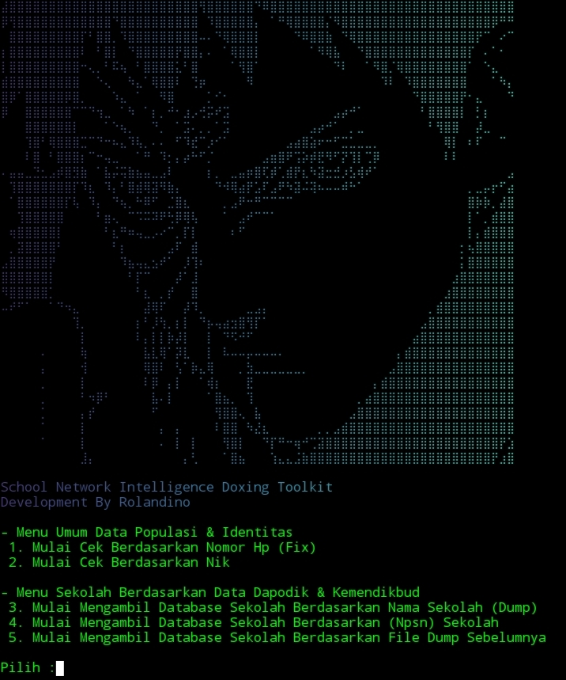
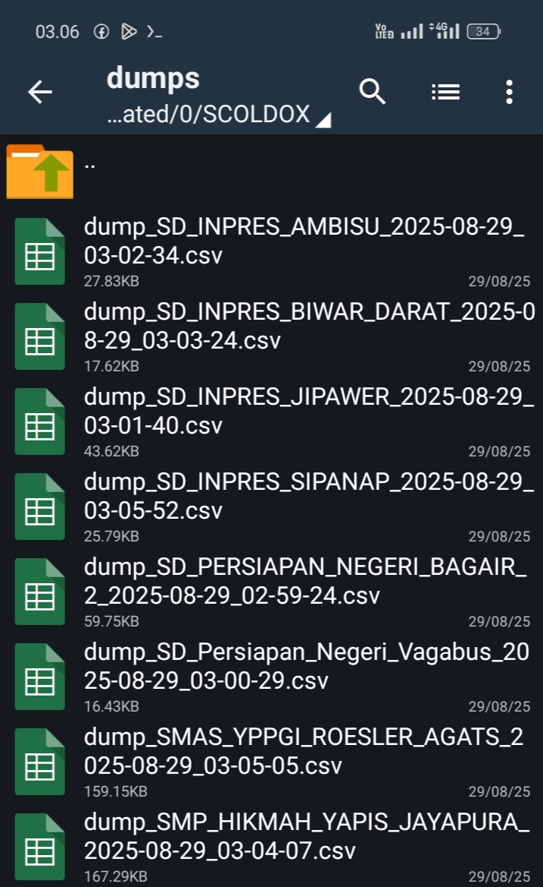
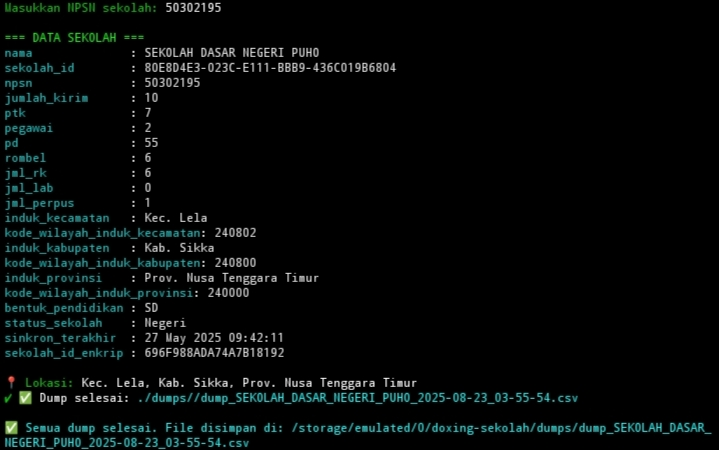
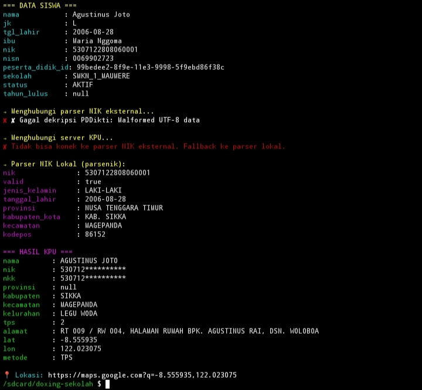

# School Network Intelligence Doxing Toolkit 

---

# Dokumentasi & Deskripsi 

## Video Dokumentasi 1 ( All Validate )

## Video Dokumentasi 2 ( Validate Kpu ) 

**School Network Intelligence Doxing Toolkit** Adalah Sebuah Script Investigasi Berbasis **Doxing (Private Intelligence)** Yang Berfokus Pada Pengumpulan Data **Populasi & Pendidikan** Di Indonesia

Program Ini Dirancang Untuk Melakukan Pencarian, Validasi, Serta Ekstraksi Informasi Dari Sumber Terkait **Identitas & Database Sekolah (Dapodik & Kemendikbud)**

---

### Menu Data Populasi & Identitas 
- **Cek Berdasarkan Nomor HP**  
  Mendapatkan Metadata Nomor HP + Integrasi Ke Parser Identitas.  
- **Cek Berdasarkan NIK**  
  Parsing & Validasi NIK Secara Detail, Dilengkapi Fallback Parser KPU

### Menu Sekolah (Dapodik & Kemendikbud) 
- **Dump Database Sekolah Berdasarkan Nama**  
  Mengambil Informasi Lengkap Sekolah Sesuai Nama  
- **Dump Database Sekolah Berdasarkan NPSN**  
  Extract Seluruh Detail Sekolah & Siswa Terdaftar 
- **Load Ulang Dump dari File Sebelumnya**  
  Membuka Kembali Database Hasil Dump Lama Tanpa Request Baru  

---

## Semua Hasil Otomatis Tersimpan Di Direktori

### Data Yang Didapat Meliputi   
(Validate Ke Database Sekolah)
- Identitas Sekolah,Npsn, Status, Jumlah Siswa, Guru, Pegawai, Detail Sinkron Terakhir 
- Nama Lengkap Murit
- Nama Lengkap Ibu
- Jenis Kelamin
- Tanggal Lahir
- Nik
- Nisn
- Peserta Didik Id
- Status Sekolah
- Tahun Lulus

(Validate Nik Siswa Ke Server Kpu)
- Nama Lengkap
- Nik
- Nkk
- Provinsi
- Kabupaten
- Kecamatan
- Kelurahan
- Tps
- Alamat Lengkap (Google Maps)
- Lat/Lon
- Metode Random

(Validate Ke Bpjs Jika Tersedia)
- Nomor Kartu Bpjs ( By Nik )
- Status Keterangan
- Jenis Peserta
- Faskes
- Hak Kelas
- Tanggal Lahir
- Tmt
- Tat

---

## Dump Sekolah Berdasarkan NPSN  

## Data Siswa & Parser NIK Dukcapil 

---

### Keunggulan
- Bisa Berjalan Untuk Semua **Terminal Root**  
- Integrasi **Parser Lokal & Fallback KPU**  
- Output Otomatis Dalam Format CSV  
- Database Sekolah **Lengkap & Detail**  
- Cocok Untuk Investigasi Di Bidang Pendidikan  

---

### Harga & Lisensi
Program Script Ini **Premium** 
- **Harga:** **Rp350.000** ( Permanet & Open Source )
- **Harga:** **Rp250.000** ( Permanent & Enc )
- Lisensi Berlaku Permanent & Open Source  
- Update & Perbaikan Bug Tersedia Gratis Setelah Pembelian  

 Untuk Pembelian & Lisensi Hubungi  
- **Telegram :** [@rolandino28](https://t.me/rolandino28)
- **Grup Telegram :** [t.me/Crackers_Teamm](https://t.me/Crackers_Teamm)
  
---

### Disclaimer
Program Ini Dibuat Hanya Untuk Riset Investigasi, Analis Data Pendidikan & Tujuan Edukasi, Segala Penyalahgunaan Di Luar Tujuan Tersebut **BUKAN TANGGUNG JAWAB DEVELOPER!**

---

